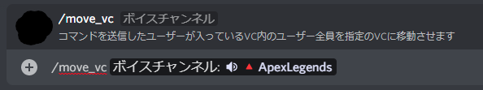

# VCMover

Discord でコマンドを送信した人がいるボイスチャンネルに居る全員を指定チャンネルに移動させます

# Requirements

`node.js v16以上`

# Install

- `npm i`を実行し、依存関係を更新します
- `config.json`を開き以下の値を入力します

| Key    | Value                     |
| ------ | ------------------------- |
| token  | DiscordBot 用のトークン   |
| server | 使用するサーバーの ID     |
| roll   | 使用を許可するロールの ID |

- `node index.js`で Bot を実行します

# Usage

`/move_vc ボイスチャンネル`
で移動させたいボイスチャンネルを指定します。

`GUILD_VOICE`を使用し、チャンネルのタブ補完もでき、スマートフォンからでも楽です
